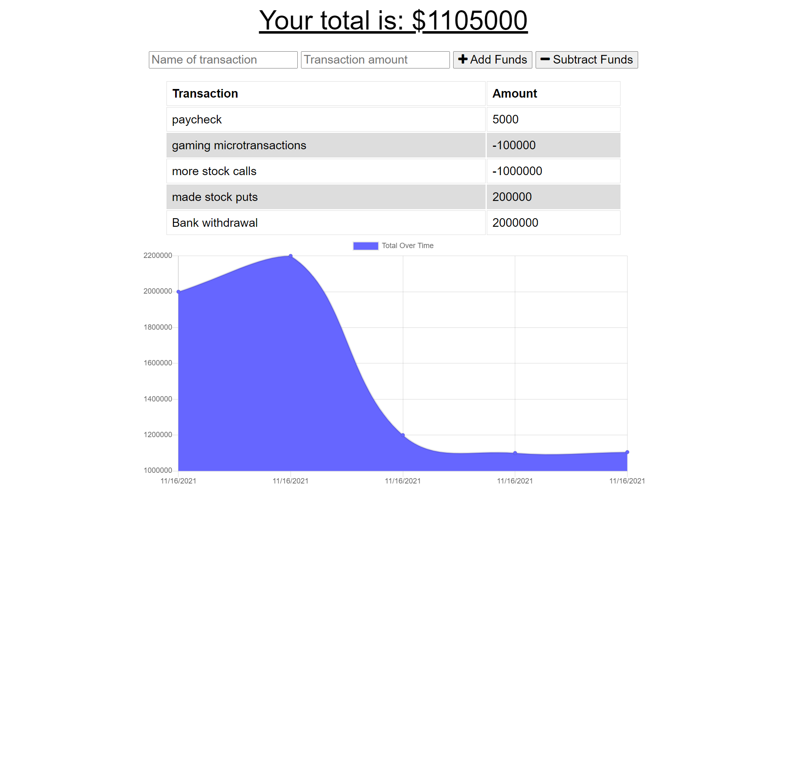

# PWA-Budget-Tracker

 ## Description
  This is a budget tracker that will keep track of your purchases and display your over all balance to let you know where you are financially.

 ## Table of Contents
  - [Insallation](#installation)
  - [Usage](#usage)
  - [Credits](#credits)
  - [License](#license)

 ## Installation
  You must first open the package.json in your terminal and then run npm -i. once you install the packages run npm i express to install express server. after that open the server.js file into your terminal and run node server.js and it will show you are connected to a local host. once the server is up and running go to your browser and enter http://localhost:3000/. 

 ## Usage
  Fiscal responsability is very important and this app lets you keep track of where you are at. You can use this app to add or subtract funds from your account. Once you have added or subtracted funds from your balance a graph will update and show you your over all balance as well as where you started. You can even use this app offline thanks to indexdb.

 ## Credits
  [BradMW](https://github.com/BradMW)

 ## License
  

 ## Features
  This app used indexdb and a service worker to store transactions that you add so that when you find an internet connection all of your changes will carry over and save to your over all balance. Whenever you add funds or subrtact funds the graph will display where you are at with your money.

  Link to Heroku where the app is deployed: https://pwa-budget-tracker-bo.herokuapp.com/

